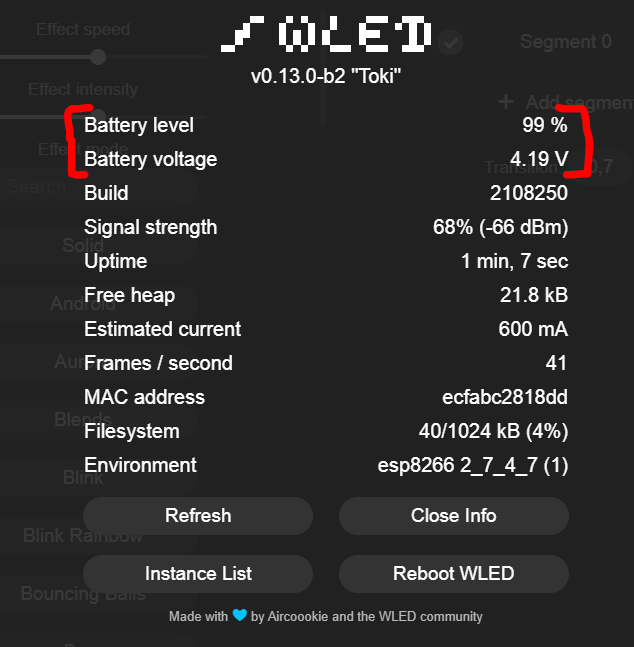

# :battery: Battery status/level Usermod :battery:

Это расширение позволяет вам контролировать уровень заряда АКБ вашего проекта с автономным питанием.

Вы можете увидеть уровень заряда АКБ и напряжения, нажав `Инфо` на гавноей странице. 

Чтобы все работало, положительный контакт АКБ (18650) должен быть подключен к контакту `A0` d1mini/esp8266 через резистор 100 кОм. (см. [Полезные ссылки](#полезные-ссылки)).

Если используете esp32, лучше всего подключить положительный контакт АКБ к ADC1 (GPIO32 - GPIO39)

  

## Установка

Добавить определение `USERMOD_BATTERY_STATUS_BASIC` в файле `my_config.h`

### Основная схема подключения

  

### Определение ваших значений по умолчанию

* `USERMOD_BATTERY_STATUS_BASIC`                   - вставьте это (в `my_config.h`) чтобы расширение подключилось в wled00\usermods_list.cpp
* `USERMOD_BATTERY_MEASUREMENT_PIN`                - контакт по умолчанию A0 для esp8266 и GPIO32 для esp32
* `USERMOD_BATTERY_MEASUREMENT_INTERVAL`           - частота опроса состояния АКБ, по умолчанию 30 секунд
* `USERMOD_BATTERY_MIN_VOLTAGE`                    - минимальное напряжение у АКБ, по умолчанию 2.6 Вольта (стандартно для 18650)
* `USERMOD_BATTERY_MAX_VOLTAGE`                    - максимальное напряжение у АКБ, по умолчанию 4.2 Вольта (стандартно для 18650)

Все параметры можно изменить в запущеной на модуле прошивке со страницы "Настройки" в разделе "Расширения пользователя" (Usermods).

## Важно :warning:
* Убедитесь, что вы знаете характеристики вашего АКБ! Не все АКБ одинаковы !
* Пример:

| Таблица характеристик вашего АКБ  |                 | Опции, которые можно задать   | 
| :-------------------------------- |:--------------- | :---------------------------- |
| Capacity                          | 3500mAh 12,5 Wh |                               |
| Minimum capacity                  | 3350mAh 11,9 Wh |                               |
| Rated voltage                     | 3.6V - 3.7V     |                               |
| **Charging end voltage**          | **4,2V ± 0,05** | `USERMOD_BATTERY_MAX_VOLTAGE` |
| **Discharge voltage**             | **2,5V**        | `USERMOD_BATTERY_MIN_VOLTAGE` |
| Max. discharge current (constant) | 10A (10000mA)   |                               |
| max. charging current             | 1.7A (1700mA)   |                               |
| ...                               | ...             | ...                           |
| ..                                | ..              | ..                            |

Характеристики для:  [Molicel INR18650-M35A, 3500mAh 10A Lithium-ion battery, 3.6V - 3.7V](https://www.akkuteile.de/lithium-ionen-akkus/18650/molicel/molicel-inr18650-m35a-3500mah-10a-lithium-ionen-akku-3-6v-3-7v_100833)

## Полезные ссылки
* https://lazyzero.de/elektronik/esp8266/wemos_d1_mini_a0/start
* https://arduinodiy.wordpress.com/2016/12/25/monitoring-lipo-battery-voltage-with-wemos-d1-minibattery-shield-and-thingspeak/

## История изменений
2021-09-02
* Добавлен пункт "Напряжение АКБ" в окно `Инфо`
* Добавлена схема подключения в readme
* Добавлена поддержка MQTT, отправление напряжения АКБ
* Мелкие правки

2021-08-15
* Изменено значение `USERMOD_BATTERY_MIN_VOLTAGE` на 2.6 Вольт для АКБ 18650
* Обновлен readme, добавлена таблица спецификаций

2021-08-10
* Создан

